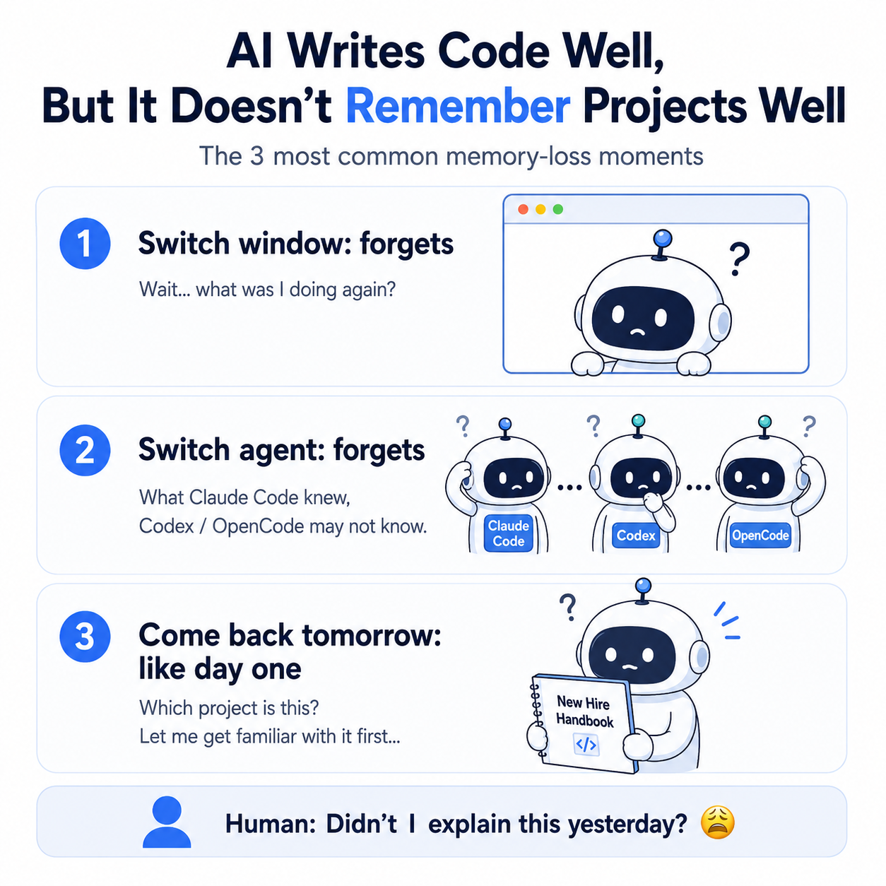
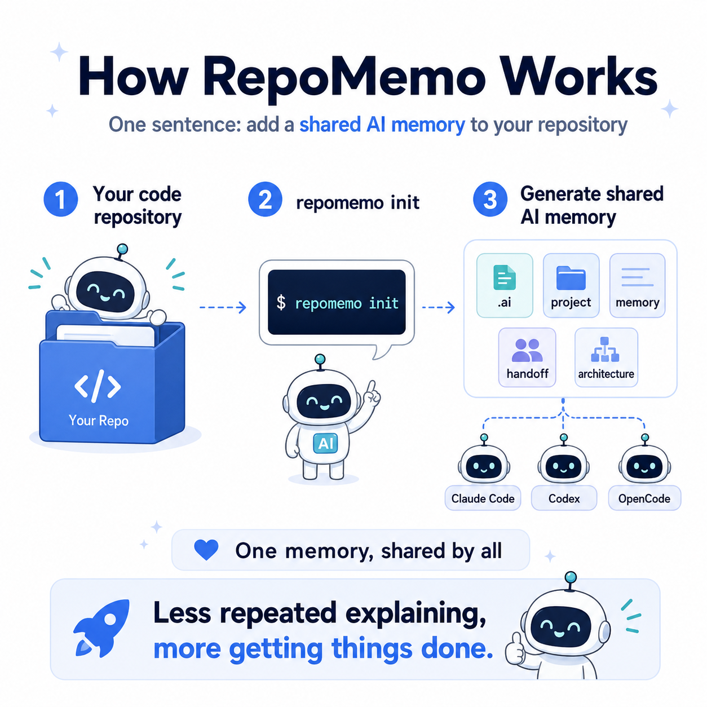
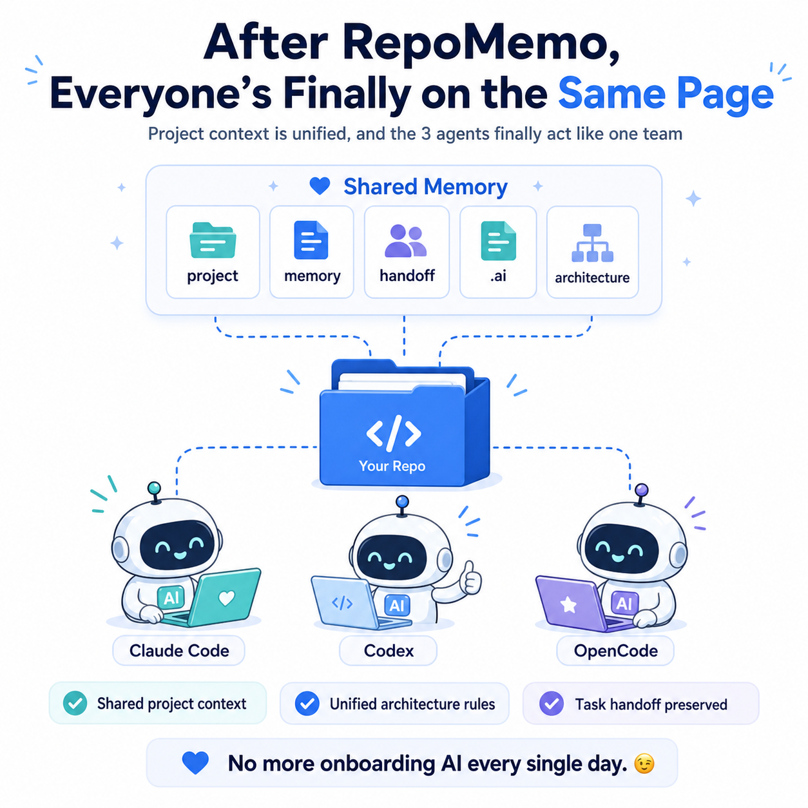
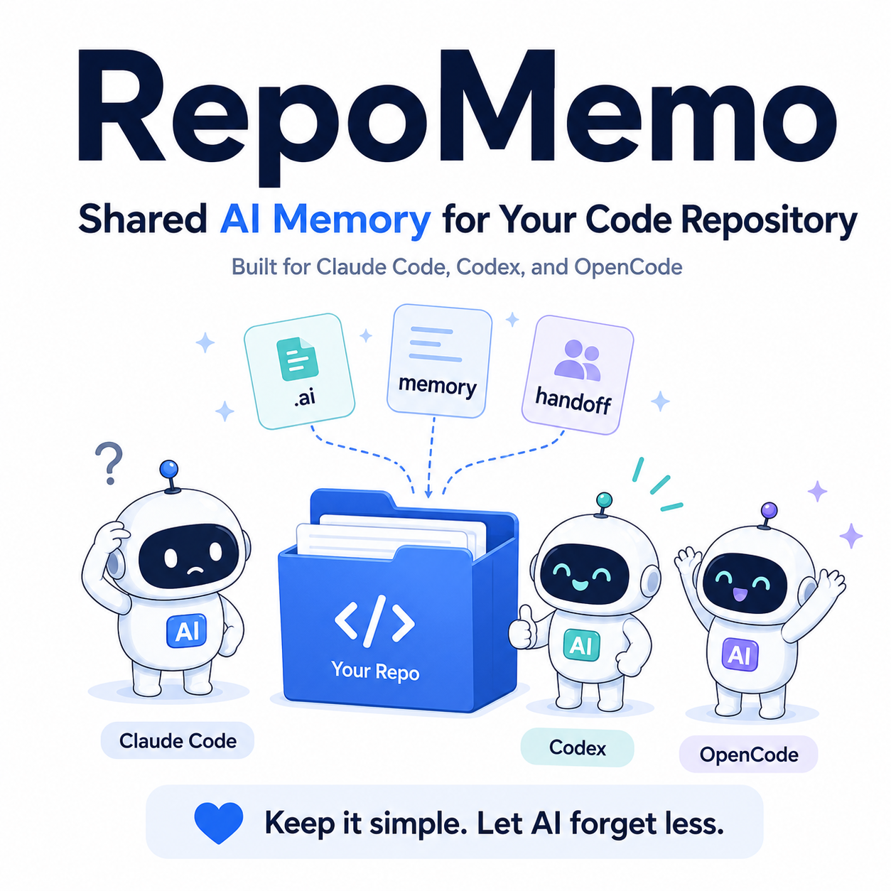

# RepoMemo

> **Languages:** **English** · [简体中文](./README.zh.md)

A small CLI that drops a shared, version-controlled **AI project memory** into
any repository. Run `repomemo init` and any AI coding agent that respects
the `CLAUDE.md`, `AGENTS.md`, or `opencode.md` convention will read the same
project facts, in the same order, every session.

```bash
repomemo init      # scaffold .ai/, CLAUDE.md, AGENTS.md, opencode.md in the current repo
repomemo check     # validate the scaffold is complete and non-empty
repomemo check --verify  # also check that shared memory is actually being used
repomemo upgrade   # update root adapters from local templates
repomemo upgrade --fetch  # fetch latest templates from GitHub, then upgrade
```

repomemo is **tool-neutral**. It is not authored by, owned by, or specific to
any single AI agent. The list of supported / compatible agents (Claude Code,
OpenCode, Codex, Cursor, and any other tool that reads `CLAUDE.md`,
`AGENTS.md`, or `opencode.md`) is not the same as the list of project
contributors.

## Quick start

```bash
# 1. Install (pick one)
brew tap SUN-1024/repomemo && brew install repomemo
# or:
curl -fsSL https://raw.githubusercontent.com/SUN-1024/repomemo/main/install.sh | bash
# or:
npm install -g repomemo

# 2. Run inside your project
cd /path/to/your/repo
repomemo init      # writes .ai/, CLAUDE.md, AGENTS.md, opencode.md (skips files that already exist)
repomemo check     # validates the scaffold is complete and non-empty

# 3. Make it yours
#    edit .ai/project.md and .ai/architecture.md to describe the real project
#    replace the "Required commands" section in .ai/definition-of-done.md
#    git add .ai CLAUDE.md AGENTS.md opencode.md && git commit -m "chore: adopt repomemo"
```

After step 3, every AI coding agent that respects `CLAUDE.md`, `AGENTS.md`,
or `opencode.md` reads the same files in the same order at session start.

## What it generates

```
.ai/
  README.md              # convention + read order
  project.md             # purpose, stakeholders, scope, non-goals
  architecture.md        # stack, layout, components, decisions
  definition-of-done.md  # what "done" means in this repo
  review-checklist.md    # PR review rubric
  memory.md              # durable shared knowledge
  handoff.md             # rolling state of the latest task
CLAUDE.md                # adapter for agents that resolve @./path imports
AGENTS.md                # adapter for agents that read a numbered file list
opencode.md              # adapter for agents that resolve @./path imports
```

`CLAUDE.md`, `AGENTS.md`, and `opencode.md` never duplicate content; they only
point into `.ai/`. Every agent sees the same files in the same order.

## How it works

<p align="center">
  
</p>

<p align="center">
  
  
  
</p>

## Why

Different AI coding agents read different instruction files at session start.
Without a shared layout, two agents in the same repo drift: one knows about
a decision the other does not, and a human spends time reconciling them.

repomemo encodes the smallest convention that gives every supported agent
a single source of truth, without locking the project into a particular
language, framework, or harness.

## Install

### Homebrew (recommended on macOS)

```bash
brew tap SUN-1024/repomemo
brew install repomemo
```

The tap repository is `SUN-1024/homebrew-repomemo`; the formula is mirrored
inside this repo at `homebrew/repomemo.rb` for reference.

### Curl one-liner (macOS / Linux)

```bash
curl -fsSL https://raw.githubusercontent.com/SUN-1024/repomemo/main/install.sh | bash
```

The script downloads the latest release tarball, installs `repomemo` to
`/usr/local/bin/repomemo`, and places the templates under
`/usr/local/share/repomemo/templates`. It uses `sudo` only if the prefix is
not writable. Override the install location or version with environment
variables:

```bash
REPOMEMO_PREFIX="$HOME/.local" \
REPOMEMO_VERSION=v1.0.0 \
  bash <(curl -fsSL https://raw.githubusercontent.com/SUN-1024/repomemo/main/install.sh)
```

### npm (cross-platform)

Install the npm package:

```bash
npm install -g repomemo
# or:
pnpm add -g repomemo
# or:
yarn global add repomemo
```

The package is a thin wrapper around the same Bash CLI, so a Bash 3.2+
shell is still required.

### From source

```bash
git clone https://github.com/SUN-1024/repomemo.git
cd repomemo
ln -s "$PWD/bin/repomemo" /usr/local/bin/repomemo   # or any directory on $PATH
```

### Without installing

```bash
git clone https://github.com/SUN-1024/repomemo.git
./repomemo/bin/repomemo --help
```

## Usage

```bash
repomemo init                    # initialize in the current directory
repomemo init --target ./my-app  # initialize in a different directory
repomemo init --force            # overwrite existing files (dangerous)
repomemo upgrade                 # update root adapters from local templates
repomemo upgrade --fetch          # fetch latest from GitHub, then upgrade
repomemo upgrade --target ./my-app
repomemo check                   # validate the current directory
repomemo check ./my-app          # validate another path
repomemo check --strict          # also validate adapter order and template sync
repomemo check --verify          # strict + verify memory is actually in use
repomemo --version
repomemo --help
```

`repomemo init` is **safe by default**: existing files are reported as
*skipped*, never overwritten silently. Pass `--force` only when you know you
want to replace the current scaffold.

`repomemo check` validates that the scaffold files exist and are non-empty.
`repomemo check --strict` additionally verifies that the root adapters point at
the same `.ai/` files in the same order. In the repomemo source repository, it
also checks that `templates/` matches the CLI's scaffold file list.
`repomemo check --verify` does all of the above, then checks that `.ai/memory.md`
and `.ai/handoff.md` have been customized (not left as template placeholders)
and that every root adapter has the no-private-memory instruction — confirming
the shared memory system is actually working.

After running `init`, edit the generated `.ai/project.md` and
`.ai/architecture.md` so they describe your real project, then commit
everything.

## How agents read the generated files

```
session starts
  agent that reads CLAUDE.md   ─► resolves @./path imports ─► loads .ai/* in order
  agent that reads opencode.md ─► resolves @./path imports ─► loads .ai/* in order
  agent that reads AGENTS.md   ─► follows the numbered list ─► loads .ai/* in order

agent does work
  before reporting "done":
    update .ai/handoff.md   (always)
    update .ai/memory.md    (when a stable fact emerges)
```

The read order is fixed:
`README.md → project.md → architecture.md → definition-of-done.md → review-checklist.md → memory.md → handoff.md`.

## The only runtime rule

After **any** implementation, debugging, refactor, review, documentation,
setup, dependency, config, or test-related task, agents update
`.ai/handoff.md` **before** declaring the task done. Stable knowledge
discovered during the task is appended to `.ai/memory.md` (or the most
relevant `.ai/` file) in the same change.

`.ai/` files never contain `TODO` / `TBD` / placeholder text. If a fact is
genuinely undefined for a project, the file says so in one clear sentence.

## Without installing the CLI: paste-a-prompt path

If you would rather have an agent read your repo and generate the scaffold
from scratch (instead of using the CLI), paste the following prompt into a
fresh session of any AI coding agent in the target repository:

```text
Initialize this repository for shared AI project memory across any agent
that reads CLAUDE.md, AGENTS.md, or opencode.md.

1. Inspect the repo first: READMEs, package manifests, source tree, configs,
   scripts, tests, CI, Docker / deploy files, docs, and any existing AI
   instruction files. Only write facts that are supported by the repository —
   no placeholders, no "TODO", no invented purpose / commands / architecture.

2. Create `.ai/` with seven files, each populated from the real repo state:
   - `README.md`             explains the convention; agents read these files
                             in order before any work and update `handoff.md`
                             before reporting done.
   - `project.md`            purpose, stakeholders, scope, constraints,
                             runtime, deploy targets, external services,
                             non-goals.
   - `architecture.md`       stack, repo layout, components, data flow,
                             dependencies, entry points, visible decisions.
   - `definition-of-done.md` real build / test / lint / typecheck / format
                             commands; if a command is not defined, say so
                             in one sentence rather than inventing one.
   - `review-checklist.md`   practical PR checklist (correctness, tests,
                             typing, lint, security, perf, docs, compat,
                             deployment risk).
   - `memory.md`             durable shared knowledge, conventions,
                             constraints, recurring pitfalls.
   - `handoff.md`            latest task, files changed, commands run, checks
                             performed, current state, unresolved unknowns,
                             next safe action.

3. Create thin root adapters:
   - `CLAUDE.md` containing only `@./.ai/<file>` imports for the seven files
     above, in the read order defined by `.ai/README.md`.
   - `opencode.md` containing the same `@./.ai/<file>` imports in the same
     read order.
   - `AGENTS.md` listing the same seven files in the same order as a numbered
     reading list, plus the rule: "After future implementation, debugging,
     refactor, review, documentation, setup, dependency, config, or test
     tasks, update `.ai/handoff.md` before reporting done; update
     `.ai/memory.md` when stable knowledge emerges."

4. Verify: list the created files and run `git status`. Run any safe existing
   checks only if they are already configured in the repo.

5. Final response: summarize files created/updated, key facts inferred,
   unknowns, and checks run.
```

## Supported AI coding agents

repomemo ships with three adapters because different agents read different
instruction files at session start:

- `CLAUDE.md` — used by agents that natively resolve `@./path` imports.
- `opencode.md` — used by agents that natively resolve `@./path` imports.
- `AGENTS.md` — used by agents that read an explicit numbered file list.

Listed agents are **compatible**, not contributors. repomemo does not ship as
a plugin to any of them, and they did not author this repository.

## Development

repomemo is a single Bash script plus a `templates/` directory.

```bash
# run tests
bash tests/test_repomemo.sh

# run the CLI directly from the repo without installing
bash bin/repomemo --help

# repomemo should pass its own check on this repository
bash bin/repomemo check .
bash bin/repomemo check --strict .
```

### Releases

1. Update `VERSION` in `bin/repomemo` and the `version` / `url` lines in
   `homebrew/repomemo.rb`.
2. Tag the commit: `git tag v1.0.0 && git push --tags`. The release workflow
   in `.github/workflows/release.yml` creates a GitHub release from the tag
   and prints the SHA256 of the source tarball.
3. Copy the SHA256 into `homebrew/repomemo.rb` and push the formula to
   `SUN-1024/homebrew-repomemo` so `brew install repomemo` picks it up.

## What this is *not*

- Not a runtime, library, language-specific framework, or hook system.
- Not a `settings.json` generator (those live in the consuming project).
- Not opinionated about which AI agent is "primary" — every supported
  adapter is equal.

## License

[MIT](./LICENSE)
